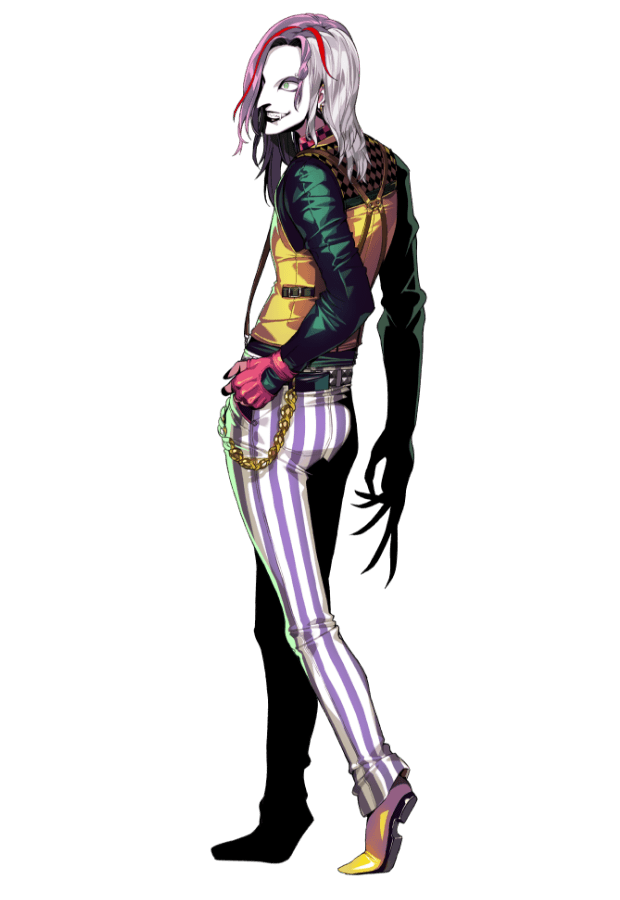

---
hide:
  - navigation
  - toc
---

  
<a href="../">← FLATTT / 返回成员</a><a href="../../">FACTIONS / 返回阵营</a>

  <section class="cp-hero">
    

    

      
FLATTT / CHARACTER

      <h1>MURASAKI</h1><h2>ムラサキ</h2>
      
擅长设局算计他人的人物。前三任 Leader 接连失踪。

      
<b>ROLE</b> FLATTT Leader

      
<b>CV</b> 二階堂明日郎

      
<button class="cp-voice-btn" data-voice="https://download.alicesoft.com/dohnadohna/voice/chara/flattt01_01.mp4">♪ VOICE 01</button> <button class="cp-voice-btn" data-voice="https://download.alicesoft.com/dohnadohna/voice/chara/flattt01_02.mp4">♪ VOICE 02</button> <button class="cp-voice-btn" data-voice="https://download.alicesoft.com/dohnadohna/voice/chara/flattt01_03.mp4">♪ VOICE 03</button>

    

  </section>

  <section class="cp-block"><h2>PROFILE / 角色资料</h2>
擅长设局算计他人的人物。前三任 Leader 接连失踪。
</section>
  <section class="cp-block"><h2>BATTLE / SKILLS</h2>
战斗与技能资料待核实。
</section>
  <section class="cp-block"><h2>WEAPON</h2>
武器资料待核实。
</section>
  <section class="cp-block"><h2>GUIDE</h2>
角色攻略待补充。
</section>
  <section class="cp-block"><h2>EVENT / STORY</h2>
剧情与事件资料待补充。
</section>

