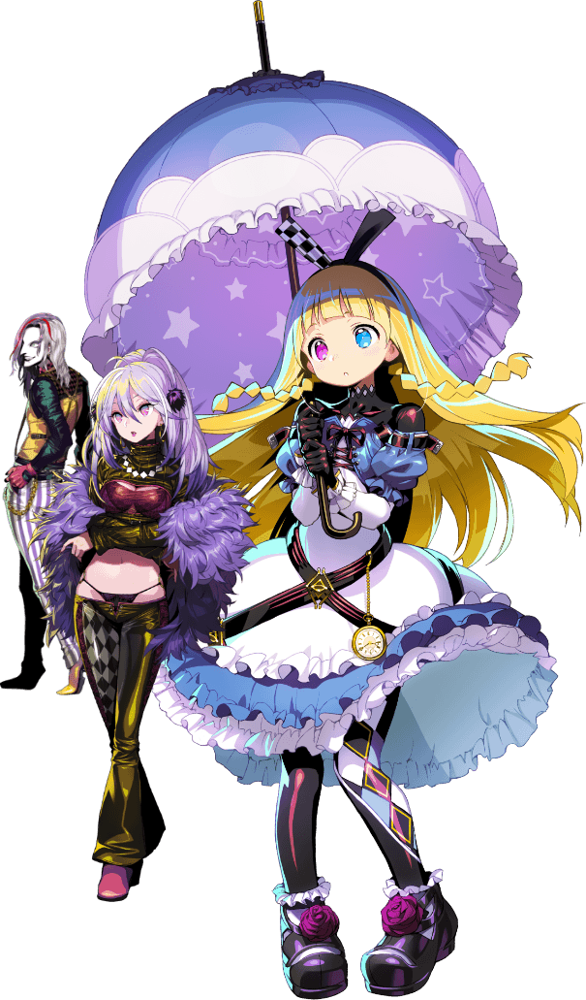

---
hide:
  - navigation
  - toc
---

  

    <a class="dd4-back" href="../">← HOME / 返回首页</a>
    CHARACTER DATABASE // 00
  

  <section class="dd4-faction-hero">
    

      
DONA DONA / CHARACTER DATABASE

      <h1>FACTIONS</h1>
      <h2>阵营一览</h2>
      
先选择角色所属阵营，再进入阵营页面浏览成员、战斗资料与角色攻略。

      
<i></i><i></i><i></i>

    

    

      
FACTIONS

      
      <b>SELECT YOUR CLAN</b>
    

  </section>

  

    
<small>CLAN INDEX</small><h2>SELECT FACTION</h2>

    06 GROUPS / CHARACTER ARCHIVE
  

  <section class="dd4-faction-grid">
    <a class="dd4-fcard dd4-fcard-main" href="nayuta/">
      
01

      

        <small>AVAILABLE // CLAN 01</small><h3>NAYUTA</h3><b>ナユタ</b>
        
规模最小的 Clan。行动风格很大程度上反映了领导者随性、走一步看一步的性格。

        ENTER DATABASE →
      

      
    </a>

    <a class="dd4-fcard dd4-fcard-flattt" href="flattt/">
      
02

      

        <small>AVAILABLE // CLAN 02</small>
        <h3>FLATTT</h3><b>フラット</b>
        
利用城市暗中牟利的 Clan，也不避讳为此使用暴力。

        ENTER DATABASE →
      

      
    </a>
    

03
<small>CLAN 03</small><h3>SHINONOME-HA</h3><b>東雲派</b>
以城市旧名命名的大型势力，以打倒亜総義为共同目标。
COMING SOON

    

04
<small>CLAN 04</small><h3>ASOUGI</h3><b>亜総義重工</b>
庞大企业集团的核心，与亜総義市民的生活密不可分。
COMING SOON

    

05
<small>ARCHIVE 05</small><h3>OTHERS</h3><b>ほか</b>
不归属于以上主要 Clan 的相关角色。
COMING SOON

    

06
<small>ARCHIVE 06</small><h3>UNIQUE</h3><b>ユニークヒロイン</b>
拥有独立资料与相关事件的特殊角色。
COMING SOON

  </section>

