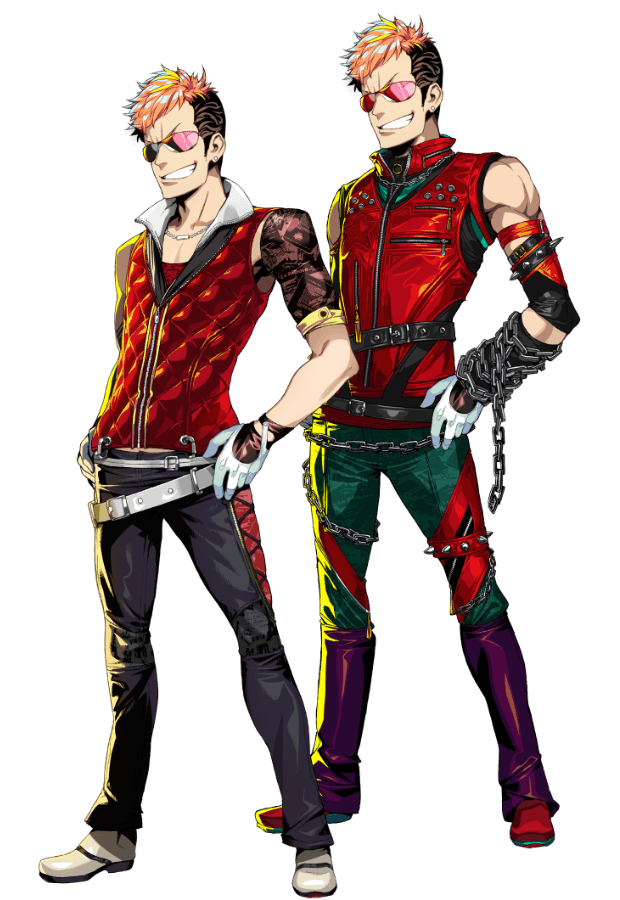

---
hide:
  - navigation
  - toc
---

  

    <a class="dd4-back" href="../">← FACTIONS / 返回阵营</a>
    CHARACTERS / FACTIONS / NAYUTA
  

  <section class="dd4-nayuta-hero">
    

      <small>NAYUTA // CLAN DATABASE</small>
      <h1>NAYUTA</h1>
      <h2>ナユタ</h2>
      
角色资料、技能、武器、战斗定位与玩家攻略。

      
<b>05</b>PLAYABLE MEMBERS<i></i><b>01</b>CLAN DATABASE

    

    

      
NAYUTA

      
    

  </section>

  

    
<small>MEMBER SELECT</small><h2>CHARACTER DATABASE</h2>

    SELECT A MEMBER TO OPEN PROFILE
  

  <section class="dd4-member-grid">
    <a class="dd4-member dd4-member-01" href="kuma/">
      
01

      
<small>NAYUTA // MEMBER 01</small><h3>KUMA</h3><b>クマ</b>
枪击 · 近战爆发 · 中远程补刀
VIEW DATABASE →

      
    </a>
    <a class="dd4-member dd4-member-02" href="zappa/">
      
02

      
<small>NAYUTA // MEMBER 02</small><h3>ZAPPA</h3><b>ザッパ</b>
打属性 · 前排 · 承伤
VIEW DATABASE →

      
    </a>
    <a class="dd4-member dd4-member-03" href="porno/">
      
03

      
<small>NAYUTA // MEMBER 03</small><h3>PORNO</h3><b>ポルノ</b>
Debuff · 高速行动 · 弱化敌人
VIEW DATABASE →

      
    </a>
    <a class="dd4-member dd4-member-04" href="kirakira/">
      
04

      
<small>NAYUTA // MEMBER 04</small><h3>KIRAKIRA</h3><b>キラキラ</b>
主力输出 · 近战 · 范围攻击
VIEW DATABASE →

      
    </a>
    <a class="dd4-member dd4-member-05" href="torataro/">
      
05

      
<small>NAYUTA // MEMBER 05</small><h3>TORATARO</h3><b>虎太郎</b>
多射程 · 特殊输出 · 防御姿态
VIEW DATABASE →

      
    </a>
  </section>

